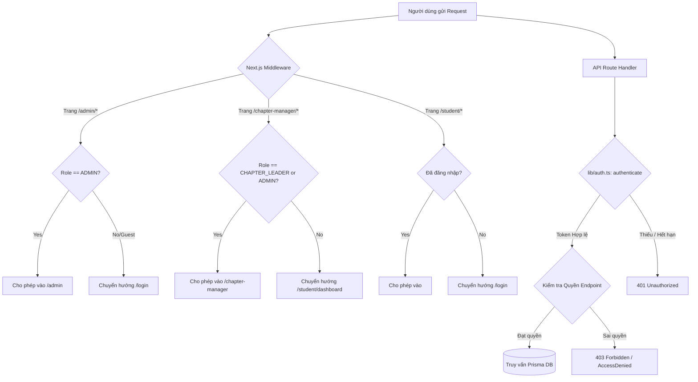

# PHASE 00 — PROJECT DISCOVERY REPORT
**Dự án:** BBE E-Learning Platform  
**Ngày thực hiện:** 2026-09-09  
**Người thực hiện:** Hệ thống Audit Tự động Antigravity  
**Trạng thái Phase 00:** **COMPLETED (PASS)**  

---

## 1. TỔNG QUAN DỰ ÁN & KIẾN TRÚC HỆ THỐNG

### 1.1 Mục tiêu hệ thống
BBE E-Learning là nền tảng đào tạo nội bộ của câu lạc bộ Doanh nhân BBE (BBE Club), phục vụ 3 nhóm đối tượng người dùng chính:
1. **Admin (Quản trị viên toàn hệ thống):** Quản lý toàn bộ Chapter, người dùng, phân quyền, cấu hình khóa học, bài học, tài liệu, đề kiểm tra đánh giá, giám sát tiến độ toàn hệ thống.
2. **Chapter Leader (BĐHU - Ban Điều Hành Chapter):** Quản lý thành viên trong Chapter của mình, gửi lời mời tham gia, theo dõi tiến độ học tập và kết quả bài thi của học viên thuộc Chapter phụ trách.
3. **Member (TV - Thành viên / Học viên):** Tham gia học tập theo lộ trình, xem video bài giảng (có cơ chế chống tua gian lận), tải tài liệu chuyên môn, làm bài kiểm tra trắc nghiệm cuối khóa, theo dõi tiến độ và xếp hạng học tập (Streak / Leaderboard).

---

### 1.2 Tech Stack Hiện Tại

| Thành phần | Công nghệ / Thư viện | Phiên bản | Ghi chú & Đánh giá |
| :--- | :--- | :--- | :--- |
| **Framework Fullstack** | Next.js (App Router) | `^14.2.35` | Kiến trúc Route Handlers + React Server/Client Components |
| **Giao diện & Styling**| React + TailwindCSS | `18.3.1` / `^3.4.19` | Dựa trên Design Tokens chuẩn BBE (Navy `#172554`, Blue `#2563EB`, Orange `#F97316`) |
| **Ngôn ngữ** | TypeScript | `^5.9.3` | Strict type checking, build targets ES2020 |
| **Cơ sở dữ liệu** | PostgreSQL (Supabase) | pg `^8.23.0` | Hỗ trợ 2 chế độ kết nối: Pooled Connection (PgBouncer port 6543) & Direct (port 5432) |
| **ORM** | Prisma ORM | `6.19.3` | Schema đầy đủ indexes, foreign keys cascade, enums Postgres native |
| **Xác thực & Mã hóa** | `jose`, `bcrypt` | `jose ^6.2.10`, `bcrypt ^6.0.0` | JWT Access Token (stateless) + Database-backed Refresh Token + Reset Token (HMAC SHA-256 peppered) |
| **Lưu trữ tệp (Storage)**| Cloudflare R2 | `@aws-sdk/client-s3 ^3.1121.0` | Tương thích S3 API. Hỗ trợ cả Upload trực tiếp qua API server & S3 Presigned URLs |
| **Email Service** | Resend SDK | `resend ^6.25.0` | Gửi email kích hoạt tài khoản, lời mời chapter và đặt lại mật khẩu kèm inline CID logo |
| **Video Engine** | YouTube Iframe Player API | Custom Component | Nhúng iframe YouTube, custom overlay controls, seek-ahead barrier, 12s heartbeat, auto-complete ≥85% |
| **Caching Layer** | Node.js In-Memory `Map` | Custom (`lib/server-cache.ts`) | Cache in-memory theo TTL cho User Auth, Overview, Chapters, Courses, Invitations (Chưa dùng Redis ngoài) |
| **Background / Cron** | HTTP Webhook Endpoint | `/api/v1/attempts/auto-submit` | Tự động chấm điểm các bài kiểm tra quá thời gian; bảo vệ bằng `CRON_SECRET` |

---

## 2. CẤU TRÚC THƯ MỤC DỰ ÁN (PROJECT STRUCTURE)

```text
E-learning/
├── .env                         # Cấu hình biến môi trường cục bộ (DB, R2, JWT, Resend, Admin)
├── package.json                 # Dependencies & scripts dự án
├── tsconfig.json                # Cấu hình TypeScript compiler
├── tailwind.config.ts           # Cấu hình theme Tailwind & tokens
├── prisma/
│   ├── schema.prisma            # Schema định nghĩa 19 Models & 11 Enums (PostgreSQL Supabase)
│   └── seed.ts                  # Dữ liệu khởi tạo (Admin mặc định, Chapter mẫu)
├── public/                      # Static assets (images, logos, icons)
├── src/
│   ├── middleware.ts            # Route protection & role-based redirection dựa trên cookies
│   ├── components/              # Reusable UI components & Layouts
│   │   ├── YouTubePlayer.tsx    # Trình phát video YouTube kèm chống tua & heartbeat
│   │   ├── layout/              # Sidebar, AppShell, Header
│   │   └── ui/                  # Button, Card, Input, Modal, Textarea, Toast
│   ├── lib/                     # Utilities & Core Services
│   │   ├── auth.ts              # Authentication & Authorize helpers, in-memory user cache
│   │   ├── prisma.ts            # Prisma client singleton instance
│   │   ├── tokens.ts            # Cryptographic token hashing & generation
│   │   ├── email.ts             # Resend email templates & dispatcher
│   │   ├── server-cache.ts      # Multi-domain in-memory caching engine
│   │   ├── api/client.ts        # Client-side fetch wrapper (localStorage sync, dedup)
│   │   └── progress/            # Thuật toán tính toán tiến độ & streak học viên
│   └── app/                     # Next.js App Router
│       ├── (auth)/              # login, forgot-password, reset-password, accept-invitation
│       ├── admin/               # Admin Portal (dashboard, users, chapters, courses, invitations)
│       ├── chapter-manager/     # Chapter Leader Portal (dashboard, members, courses, invitations)
│       ├── student/             # Member Portal (dashboard, courses, learning, quiz, progress)
│       ├── leaderboard/         # Bảng xếp hạng vinh danh học tập
│       └── api/                 # REST API Handlers (v1 & internal)
```

---

## 3. FEATURE INVENTORY

| ID | Module | Feature | Frontend | Backend | API | DB Entities | Role Cho Phép |
| :--- | :--- | :--- | :--- | :--- | :--- | :--- | :--- |
| **AUTH-01** | Auth | Đăng nhập bằng Email/Mật khẩu | `/login` | `api/v1/auth/login` | `POST` | `User`, `RefreshToken` | Guest / All |
| **AUTH-02** | Auth | Đăng xuất & Thu hồi Refresh Token | Navbar/Sidebar | `api/v1/auth/logout` | `POST` | `RefreshToken` | Authenticated |
| **AUTH-03** | Auth | Refresh Access Token tự động | `lib/api/client.ts` | `api/v1/auth/refresh` | `POST` | `User`, `RefreshToken` | Authenticated |
| **AUTH-04** | Auth | Quên mật khẩu & Gửi link đặt lại | `/forgot-password` | `api/v1/auth/password-reset/request` | `POST` | `User`, `PasswordResetToken` | Guest / All |
| **AUTH-05** | Auth | Đặt lại mật khẩu mới qua Token | `/reset-password` | `api/v1/auth/password-reset/confirm` | `POST` | `User`, `PasswordResetToken` | Guest / All |
| **AUTH-06** | Auth | Kích hoạt tài khoản từ lời mời | `/accept-invitation` | `api/v1/invitations/accept` | `POST` | `Invitation`, `User`, `ChapterMember` | Guest / Invited |
| **AUTH-07** | Auth | Kiểm tra tính hợp lệ của Token mời | `/accept-invitation` | `api/v1/invitations/validate` | `GET` | `Invitation` | Guest / Invited |
| **USER-01** | User | Lấy thông tin cá nhân hiện tại | Tất cả UI | `api/v1/users/me` | `GET` | `User`, `ChapterMember` | Authenticated |
| **USER-02** | User | Danh sách người dùng hệ thống | `/admin/users` | `api/v1/users` | `GET` | `User`, `ChapterMember` | ADMIN |
| **USER-03** | User | Đổi trạng thái/Role/Khóa user | `/admin/users` | `api/v1/users/[userId]` | `PATCH` | `User` | ADMIN |
| **CHAP-01** | Chapter | Danh sách tất cả Chapter | `/admin/chapters`, `/chapter-manager/*` | `api/v1/chapters` | `GET` | `Chapter` | Authenticated |
| **CHAP-02** | Chapter | Dashboard tổng quan Chapter | `/chapter-manager/dashboard` | `api/v1/chapters/[chapterId]/dashboard/members` & `courses` | `GET` | `Chapter`, `ChapterMember`, `Course` | BĐHU, ADMIN |
| **CHAP-03** | Chapter | Danh sách thành viên Chapter | `/chapter-manager/members` | `api/v1/chapters/[chapterId]/members` | `GET` | `ChapterMember`, `User` | BĐHU, ADMIN |
| **CHAP-04** | Chapter | Xem tiến độ học 1 thành viên | `/chapter-manager/members/[userId]` | `api/v1/chapters/[chapterId]/members/[userId]/course-progress` | `GET` | `LessonProgress`, `Attempt` | BĐHU, ADMIN |
| **CHAP-05** | Chapter | Xóa thành viên khỏi Chapter | `/chapter-manager/members` | `api/v1/chapters/[chapterId]/members/[userId]` | `DELETE` | `ChapterMember` | BĐHU, ADMIN |
| **INV-01** | Invitation | Mời Trưởng Chapter (BĐHU) | `/admin/invitations` | `api/v1/invitations/chapter-leader` | `POST` | `Invitation`, `Chapter` | ADMIN |
| **INV-02** | Invitation | Mời Thành viên học tập (TV) | `/admin/invitations`, `/chapter-manager/invitations` | `api/v1/invitations/member` | `POST` | `Invitation`, `Chapter` | BĐHU, ADMIN |
| **INV-03** | Invitation | Danh sách lời mời đã gửi | `/admin/invitations`, `/chapter-manager/invitations` | `api/v1/invitations` | `GET` | `Invitation` | BĐHU, ADMIN |
| **INV-04** | Invitation | Gửi lại email lời mời | `/admin/invitations`, `/chapter-manager/invitations` | `api/v1/invitations/[id]/resend` | `POST` | `Invitation` | BĐHU, ADMIN |
| **INV-05** | Invitation | Hủy / Xóa lời mời | `/admin/invitations`, `/chapter-manager/invitations` | `api/v1/invitations/[id]` | `DELETE` | `Invitation` | BĐHU, ADMIN |
| **CRS-01** | Course | Xem danh mục khóa học | `/student/courses` | `api/v1/courses` | `GET` | `Course`, `Session`, `Lesson` | All (Public/Private filter) |
| **CRS-02** | Course | Chi tiết giáo trình khóa học | `/student/courses/[courseId]` | `api/v1/courses/[courseId]` | `GET` | `Course`, `Session`, `Lesson` | All (Public/Member) |
| **CRS-03** | Course | Tạo khóa học mới | `/admin/courses/new` | `api/v1/courses` | `POST` | `Course` | ADMIN |
| **CRS-04** | Course | Cập nhật thông tin khóa học | `/admin/courses/[courseId]/edit` | `api/v1/courses/[courseId]` | `PATCH` | `Course` | ADMIN |
| **CRS-05** | Course | Xóa khóa học | `/admin/courses` | `api/v1/courses/[courseId]` | `DELETE` | `Course` | ADMIN |
| **CRS-06** | Course | Xuất bản (Publish) khóa học | `/admin/courses/[courseId]/edit` | `api/v1/courses/[courseId]/publish` | `POST` | `Course` | ADMIN |
| **CRS-07** | Course | Gỡ xuất bản (Unpublish) | `/admin/courses/[courseId]/edit` | `api/v1/courses/[courseId]/unpublish` | `POST` | `Course` | ADMIN |
| **SES-01** | Session | Thêm chương học (Session) | `/admin/courses/[courseId]/edit` | `api/v1/courses/[courseId]/sessions` | `POST` | `Session` | ADMIN |
| **SES-02** | Session | Sửa / Xóa chương học | `/admin/courses/[courseId]/edit` | `api/v1/sessions/[sessionId]` | `PUT`, `DELETE` | `Session` | ADMIN |
| **SES-03** | Session | Sắp xếp thứ tự các Session | `/admin/courses/[courseId]/edit` | `api/v1/courses/[courseId]/sessions/reorder` | `PATCH` | `Session` | ADMIN |
| **LES-01** | Lesson | Thêm bài học mới | `/admin/courses/[courseId]/edit` | `api/v1/sessions/[sessionId]/lessons` | `POST` | `Lesson`, `Video` | ADMIN |
| **LES-02** | Lesson | Sửa / Xóa bài học | `/admin/courses/[courseId]/edit` | `api/v1/lessons/[lessonId]` | `PUT`, `DELETE`, `PATCH` | `Lesson`, `Video` | ADMIN |
| **LES-03** | Lesson | Xem nội dung bài học | `/student/learning/[lessonId]` | `api/v1/lessons/[lessonId]` | `GET` | `Lesson`, `Video`, `Document` | TV, BĐHU, ADMIN |
| **LES-04** | Lesson | Kiểm tra YouTube URL metadata | `/admin/courses/[courseId]/edit` | `api/v1/youtube/info` | `GET` | Không lưu DB | ADMIN |
| **DOC-01** | Document | Tải tài liệu lên bài học (Upload/Presign)| `/admin/courses/[courseId]/edit` | `api/v1/lessons/[lessonId]/documents/presign` & `upload` | `POST` | `Document` | ADMIN |
| **DOC-02** | Document | Tải tài liệu về máy (Download) | `/student/learning/[lessonId]` | `api/v1/documents/[documentId]/download` | `GET` | `Document` | TV, BĐHU, ADMIN |
| **DOC-03** | Document | Xóa tài liệu khỏi bài học | `/admin/courses/[courseId]/edit` | `api/v1/documents/[documentId]` | `DELETE` | `Document` | ADMIN |
| **PROG-01** | Progress | Gửi heartbeat vị trí video | `/student/learning/[lessonId]` | `api/v1/lessons/[lessonId]/progress` | `POST`, `PATCH` | `LessonProgress` | TV, BĐHU, ADMIN |
| **PROG-02** | Progress | Lấy tiến độ của 1 bài học | `/student/learning/[lessonId]` | `api/v1/lessons/[lessonId]/progress` | `GET` | `LessonProgress` | TV, BĐHU, ADMIN |
| **PROG-03** | Progress | Lấy tiến độ tổng thể khóa học | `/student/courses/[courseId]`, `/student/progress` | `api/v1/courses/[courseId]/my-progress` | `GET` | `LessonProgress`, `Course` | TV, BĐHU, ADMIN |
| **PROG-04** | Progress | Khóa học của tôi & Tỷ lệ hoàn thành | `/student/dashboard` | `api/v1/members/me/courses` | `GET` | `Course`, `LessonProgress` | TV, BĐHU, ADMIN |
| **STRK-01** | Streak | Tính chuỗi ngày học liên tục (Streak) | `/student/dashboard`, `/leaderboard` | `api/v1/streak` | `GET` | `LessonProgress`, `Attempt` | TV, BĐHU, ADMIN |
| **QUIZ-01** | Assessment | Cấu hình đề kiểm tra cuối khóa | `/admin/courses/[courseId]/edit` | `api/v1/courses/[courseId]/assessment` | `POST`, `GET` | `Assessment`, `Question`, `QuestionOption` | ADMIN |
| **QUIZ-02** | Assessment | Bắt đầu lượt làm bài (Attempt) | `/student/courses/[courseId]/quiz` | `api/v1/assessments/[assessmentId]/attempts` | `POST` | `Attempt`, `AttemptQuestion` | TV, BĐHU, ADMIN |
| **QUIZ-03** | Assessment | Lấy bài làm dở / Thông tin Attempt | `/student/courses/[courseId]/quiz` | `api/v1/assessments/[assessmentId]/attempts/me` | `GET` | `Attempt`, `AttemptAnswer` | TV, BĐHU, ADMIN |
| **QUIZ-04** | Assessment | Lưu đáp án từng câu hỏi | `/student/courses/[courseId]/quiz` | `api/v1/attempts/[attemptId]/answers` & `[questionId]` | `POST`, `PUT` | `AttemptAnswer` | TV, BĐHU, ADMIN |
| **QUIZ-05** | Assessment | Nộp bài kiểm tra & Chấm điểm | `/student/courses/[courseId]/quiz` | `api/v1/attempts/[attemptId]/submit` | `POST` | `Attempt`, `AttemptAnswer` | TV, BĐHU, ADMIN |
| **QUIZ-06** | Assessment | Tự động nộp bài hết giờ (Cron) | Tự động chạy định kỳ | `api/v1/attempts/auto-submit` | `POST` | `Attempt` | Cron / ADMIN |
| **LEAD-01** | Leaderboard | Bảng xếp hạng toàn hệ thống | `/leaderboard` | `api/v1/leaderboard` | `GET` | `User`, `LessonProgress`, `Attempt` | Public / All |
| **LEAD-02** | Leaderboard | Bảng xếp hạng theo từng Chapter | `/leaderboard` | `api/v1/leaderboard/chapters/[chapterId]` | `GET` | `ChapterMember`, `LessonProgress` | Public / All |
| **DASH-01** | Dashboard | Dashboard tổng thể Admin | `/admin/dashboard` | `api/v1/admin/overview` | `GET` | `User`, `Chapter`, `Course`, `Attempt` | ADMIN |

---

## 4. ROUTE INVENTORY (FRONTEND PAGES)

| Đường dẫn (URL) | Tệp nguồn (Page File) | Quyền truy cập | Bảo vệ bởi Middleware | Mô tả chức năng |
| :--- | :--- | :--- | :--- | :--- |
| `/` | `src/app/page.tsx` | Tất cả (Guest & Logged in) | Không | Landing page giới thiệu, tự chuyển hướng nếu đã đăng nhập |
| `/login` | `src/app/login/page.tsx` | Khách (Chưa đăng nhập) | Có (Chuyển tiếp dashboard nếu đã auth) | Form đăng nhập (Email/Password) |
| `/forgot-password` | `src/app/forgot-password/page.tsx` | Khách | Không | Gửi yêu cầu cấp lại mật khẩu |
| `/reset-password` | `src/app/reset-password/page.tsx` | Khách sở hữu token | Không | Nhập mật khẩu mới từ link email |
| `/accept-invitation` | `src/app/accept-invitation/page.tsx` | Khách được mời | Không | Điền thông tin tạo tài khoản theo token mời |
| `/invitations/accept`| `src/app/invitations/accept/page.tsx` | Khách được mời | Không | Alias trỏ tới `/accept-invitation` |
| `/leaderboard` | `src/app/leaderboard/page.tsx` | Tất cả người dùng | Không | Bảng vinh danh top học viên toàn quốc & theo Chapter |
| `/final-quiz-result` | `src/app/final-quiz-result/page.tsx` | Học viên vừa thi xong | Không | Màn hình hiển thị kết quả chúc mừng đỗ/trượt |
| `/lessons/[lessonId]`| `src/app/lessons/[lessonId]/page.tsx` | Developer / QA | Không | Màn hình test trình phát độc lập (Player playground) |
| **Học viên (Student)** | | | | |
| `/student/dashboard` | `src/app/student/dashboard/page.tsx` | TV, BĐHU, ADMIN | Có (Bắt buộc Authenticated) | Bàn học tập cá nhân, bài học tiếp tục, tổng quan khóa học |
| `/student/courses` | `src/app/student/courses/page.tsx` | Tất cả người dùng | Không | Danh sách khóa học có thể tham gia |
| `/student/courses/[id]`| `src/app/student/courses/[courseId]/page.tsx` | Tất cả người dùng | Không | Đề cương chi tiết khóa học, các session và bài học |
| `/student/courses/[id]/quiz`| `src/app/student/courses/[courseId]/quiz/page.tsx`| TV, BĐHU, ADMIN | Có (Bắt buộc Authenticated) | Phòng thi trắc nghiệm bấm giờ thực tế |
| `/student/learning/[id]`| `src/app/student/learning/[lessonId]/page.tsx`| TV, BĐHU, ADMIN | Không (Bảo vệ phía Component) | Trình học bài giảng video + tải tài liệu + danh mục bài học |
| `/student/progress` | `src/app/student/progress/page.tsx` | TV, BĐHU, ADMIN | Có (Bắt buộc Authenticated) | Báo cáo chi tiết tiến độ từng bài và điểm số thi |
| **Ban Điều Hành (BĐHU)**| | | | |
| `/chapter-manager/dashboard` | `src/app/chapter-manager/dashboard/page.tsx` | BĐHU, ADMIN | Có (Role: CHAPTER_LEADER, ADMIN) | Dashboard KPI của Chapter |
| `/chapter-manager/members` | `src/app/chapter-manager/members/page.tsx` | BĐHU, ADMIN | Có (Role: CHAPTER_LEADER, ADMIN) | Quản lý danh sách thành viên Chapter |
| `/chapter-manager/members/[id]`| `src/app/chapter-manager/members/[userId]/page.tsx`| BĐHU, ADMIN | Có (Role: CHAPTER_LEADER, ADMIN) | Bảng theo dõi học tập chi tiết của 1 thành viên |
| `/chapter-manager/courses` | `src/app/chapter-manager/courses/page.tsx` | BĐHU, ADMIN | Có (Role: CHAPTER_LEADER, ADMIN) | Giám sát tiến độ học tập các khóa học trong Chapter |
| `/chapter-manager/invitations` | `src/app/chapter-manager/invitations/page.tsx` | BĐHU, ADMIN | Có (Role: CHAPTER_LEADER, ADMIN) | Quản lý và gửi lời mời học viên mới |
| **Quản trị viên (Admin)** | | | | |
| `/admin/dashboard` | `src/app/admin/dashboard/page.tsx` | ADMIN | Có (Role: ADMIN duy nhất) | Trung tâm điều khiển toàn bộ nền tảng |
| `/admin/chapters` | `src/app/admin/chapters/page.tsx` | ADMIN | Có (Role: ADMIN duy nhất) | Thêm mới, chỉnh sửa thông tin các Chapter |
| `/admin/users` | `src/app/admin/users/page.tsx` | ADMIN | Có (Role: ADMIN duy nhất) | Quản lý người dùng, khóa tài khoản, đổi quyền |
| `/admin/courses` | `src/app/admin/courses/page.tsx` | ADMIN | Có (Role: ADMIN duy nhất) | Quản lý danh sách khóa học (Draft/Published) |
| `/admin/courses/new`| `src/app/admin/courses/new/page.tsx` | ADMIN | Có (Role: ADMIN duy nhất) | Form tạo khóa học mới |
| `/admin/courses/[id]/edit` | `src/app/admin/courses/[courseId]/edit/page.tsx` | ADMIN | Có (Role: ADMIN duy nhất) | Thiết lập nội dung: Bài học, Video, Tài liệu, Quiz |
| `/admin/invitations`| `src/app/admin/invitations/page.tsx` | ADMIN | Có (Role: ADMIN duy nhất) | Gửi lời mời Trưởng Chapter & Quản trị danh sách mời |

---

## 5. API INVENTORY

Hệ thống có tổng cộng **56 Route Handlers** (58 API Endpoints trong bảng liệt kê) đặt tại `src/app/api/v1/` và `src/app/api/internal/`:

| STT | Phương thức | Endpoint | Đường dẫn Handler | Quyền hạn (RBAC) | Tóm tắt tác vụ |
| :---: | :---: | :--- | :--- | :--- | :--- |
| 1 | `GET` | `/api/v1/health` | `api/v1/health/route.ts` | Public | Kiểm tra kết nối DB và trạng thái Server |
| 2 | `POST` | `/api/v1/auth/login` | `api/v1/auth/login/route.ts` | Public | Đăng nhập, trả về Access Token + Set Cookie |
| 3 | `POST` | `/api/v1/auth/logout` | `api/v1/auth/logout/route.ts` | Authenticated | Thu hồi refresh token, xóa cookies |
| 4 | `POST` | `/api/v1/auth/refresh` | `api/v1/auth/refresh/route.ts` | Public | Cấp access token mới từ refresh token |
| 5 | `POST` | `/api/v1/auth/password-reset/request` | `api/v1/auth/password-reset/request/route.ts` | Public | Tạo token reset mật khẩu & gửi email qua Resend |
| 6 | `POST` | `/api/v1/auth/password-reset/confirm` | `api/v1/auth/password-reset/confirm/route.ts` | Public | Xác thực token & đổi mật khẩu mới |
| 7 | `GET` | `/api/v1/users/me` | `api/v1/users/me/route.ts` | Authenticated | Lấy hồ sơ người dùng đang đăng nhập |
| 8 | `GET` | `/api/v1/users` | `api/v1/users/route.ts` | ADMIN | Danh sách người dùng hệ thống (kèm pagination/search) |
| 9 | `PATCH` | `/api/v1/users/[userId]` | `api/v1/users/[userId]/route.ts` | ADMIN | Cập nhật role hoặc trạng thái (ACTIVE/LOCKED) |
| 10 | `GET` | `/api/v1/chapters` | `api/v1/chapters/route.ts` | Authenticated | Danh sách tất cả Chapter có trong DB |
| 11 | `GET` | `/api/v1/chapters/[id]/dashboard/members` | `api/v1/chapters/[id]/dashboard/members/route.ts` | BĐHU, ADMIN | Số liệu thống kê thành viên thuộc Chapter |
| 12 | `GET` | `/api/v1/chapters/[id]/dashboard/courses` | `api/v1/chapters/[id]/dashboard/courses/route.ts` | BĐHU, ADMIN | Thống kê hoàn thành khóa học của Chapter |
| 13 | `GET` | `/api/v1/chapters/[id]/members` | `api/v1/chapters/[id]/members/route.ts` | BĐHU, ADMIN | Danh sách thành viên kèm tiến độ trung bình |
| 14 | `DELETE`| `/api/v1/chapters/[id]/members/[userId]` | `api/v1/chapters/[id]/members/[userId]/route.ts` | BĐHU, ADMIN | Xóa thành viên khỏi Chapter |
| 15 | `GET` | `/api/v1/chapters/[id]/members/[userId]/course-progress` | `.../course-progress/route.ts` | BĐHU, ADMIN | Chi tiết học tập của 1 học viên thuộc Chapter |
| 16 | `GET` | `/api/v1/invitations` | `api/v1/invitations/route.ts` | BĐHU, ADMIN | Danh sách các lời mời theo Chapter hoặc toàn bộ |
| 17 | `GET` | `/api/v1/invitations/validate` | `api/v1/invitations/validate/route.ts` | Public | Kiểm tra token lời mời còn hạn/hợp lệ không |
| 18 | `POST` | `/api/v1/invitations/chapter-leader` | `api/v1/invitations/chapter-leader/route.ts` | ADMIN | Gửi email mời Trưởng Chapter (BĐHU) |
| 19 | `POST` | `/api/v1/invitations/member` | `api/v1/invitations/member/route.ts` | BĐHU, ADMIN | Gửi email mời Học viên tham gia Chapter |
| 20 | `POST` | `/api/v1/invitations/accept` | `api/v1/invitations/accept/route.ts` | Public | Tạo tài khoản học viên và kích hoạt invitation |
| 21 | `POST` | `/api/v1/invitations/[id]/resend` | `api/v1/invitations/[id]/resend/route.ts` | BĐHU, ADMIN | Gửi lại email lời mời cho người dùng |
| 22 | `DELETE`| `/api/v1/invitations/[id]` | `api/v1/invitations/[id]/route.ts` | BĐHU, ADMIN | Thu hồi hoặc xóa lời mời chưa kích hoạt |
| 23 | `GET` | `/api/v1/courses` | `api/v1/courses/route.ts` | Public / Auth | Danh sách khóa học (Public hoặc All nếu là Admin) |
| 24 | `POST` | `/api/v1/courses` | `api/v1/courses/route.ts` | ADMIN | Tạo mới một khóa học (trạng thái DRAFT) |
| 25 | `GET` | `/api/v1/courses/[courseId]` | `api/v1/courses/[courseId]/route.ts` | Public / Auth | Lấy cấu trúc chi tiết khóa học, sessions & bài học |
| 26 | `PATCH` | `/api/v1/courses/[courseId]` | `api/v1/courses/[courseId]/route.ts` | ADMIN | Cập nhật tiêu đề, mô tả, hiển thị |
| 27 | `DELETE`| `/api/v1/courses/[courseId]` | `api/v1/courses/[courseId]/route.ts` | ADMIN | Xóa toàn bộ khóa học cùng sessions/lessons |
| 28 | `POST` | `/api/v1/courses/[courseId]/publish` | `api/v1/courses/[courseId]/publish/route.ts` | ADMIN | Chuyển trạng thái khóa học sang PUBLISHED |
| 29 | `POST` | `/api/v1/courses/[courseId]/unpublish` | `api/v1/courses/[courseId]/unpublish/route.ts` | ADMIN | Chuyển khóa học về DRAFT |
| 30 | `GET` | `/api/v1/courses/[courseId]/my-progress` | `api/v1/courses/[courseId]/my-progress/route.ts` | Authenticated | Xem tiến độ học viên đối với khóa học này |
| 31 | `GET` | `/api/v1/courses/[courseId]/students` | `api/v1/courses/[courseId]/students/route.ts` | BĐHU, ADMIN | Danh sách học viên đang học khóa này |
| 32 | `POST` | `/api/v1/courses/[courseId]/sessions` | `api/v1/courses/[courseId]/sessions/route.ts` | ADMIN | Thêm một chương học mới vào khóa |
| 33 | `PATCH` | `/api/v1/courses/[courseId]/sessions/reorder` | `api/v1/courses/[courseId]/sessions/reorder/route.ts` | ADMIN | Cập nhật lại số thứ tự (sort_order) các sessions |
| 34 | `GET, PUT, DELETE, PATCH` | `/api/v1/sessions/[sessionId]` | `api/v1/sessions/[sessionId]/route.ts` | ADMIN | Lấy/Sửa/Xóa một chương học cụ thể |
| 35 | `POST, PATCH` | `/api/v1/sessions/[sessionId]/lessons` | `api/v1/sessions/[sessionId]/lessons/route.ts` | ADMIN | Tạo bài học mới trong session hoặc sắp xếp bài |
| 36 | `GET, PUT, DELETE, PATCH` | `/api/v1/lessons/[lessonId]` | `api/v1/lessons/[lessonId]/route.ts` | Public (GET) / ADMIN | Xem chi tiết bài học / Sửa nội dung video |
| 37 | `GET, POST, PATCH` | `/api/v1/lessons/[lessonId]/progress` | `api/v1/lessons/[lessonId]/progress/route.ts` | Authenticated | Ghi nhận vị trí học video (Heartbeat) & Check completion |
| 38 | `POST` | `/api/v1/lessons/[lessonId]/documents/upload` | `api/v1/lessons/[lessonId]/documents/upload/route.ts` | ADMIN | Upload tài liệu tệp trực tiếp qua Server lên R2 |
| 39 | `POST` | `/api/v1/lessons/[lessonId]/documents/presign` | `api/v1/lessons/[lessonId]/documents/presign/route.ts` | ADMIN | Lấy presigned URL upload S3 cho client |
| 40 | `POST` | `/api/v1/lessons/[lessonId]/documents/confirm` | `api/v1/lessons/[lessonId]/documents/confirm/route.ts` | ADMIN | Xác nhận upload file hoàn tất vào DB |
| 41 | `DELETE`| `/api/v1/documents/[documentId]` | `api/v1/documents/[documentId]/route.ts` | ADMIN | Xóa tệp tài liệu khỏi Cloudflare R2 và Database |
| 42 | `GET` | `/api/v1/documents/[documentId]/download` | `api/v1/documents/[documentId]/download/route.ts` | Authenticated | Lấy Presigned URL tải file tài liệu đính kèm |
| 43 | `GET` | `/api/v1/youtube/info` | `api/v1/youtube/info/route.ts` | ADMIN | Lấy tiêu đề và thời lượng video từ YouTube API |
| 44 | `GET, POST` | `/api/v1/courses/[courseId]/assessment` | `api/v1/courses/[courseId]/assessment/route.ts` | Public (GET) / ADMIN | Xem / Tạo hoặc ghi đè bài thi cuối khóa |
| 45 | `GET, PATCH` | `/api/v1/assessments/[assessmentId]` | `api/v1/assessments/[assessmentId]/route.ts` | Public (GET) / ADMIN | Lấy nội dung đề thi / Sửa tiêu đề đề thi |
| 46 | `POST` | `/api/v1/assessments/[assessmentId]/attempts` | `api/v1/assessments/[assessmentId]/attempts/route.ts` | Authenticated | Bắt đầu một bài thi mới (tạo Attempt) |
| 47 | `GET` | `/api/v1/assessments/[assessmentId]/attempts/me` | `api/v1/assessments/[assessmentId]/attempts/me/route.ts` | Authenticated | Lấy lượt thi hiện tại hoặc kết quả bài thi cao nhất |
| 48 | `GET, DELETE` | `/api/v1/attempts/[attemptId]` | `api/v1/attempts/[attemptId]/route.ts` | Authenticated | Lấy chi tiết attempt hoặc hủy attempt |
| 49 | `POST` | `/api/v1/attempts/[attemptId]/answers` | `api/v1/attempts/[attemptId]/answers/route.ts` | Authenticated | Lưu nhiều câu trả lời cùng lúc |
| 50 | `PUT` | `/api/v1/attempts/[attemptId]/answers/[questionId]` | `.../answers/[questionId]/route.ts` | Authenticated | Lưu câu trả lời cho 1 câu hỏi cụ thể |
| 51 | `POST` | `/api/v1/attempts/[attemptId]/submit` | `api/v1/attempts/[attemptId]/submit/route.ts` | Authenticated | Nộp bài thi chính thức và tính điểm |
| 52 | `POST` | `/api/v1/attempts/auto-submit` | `api/v1/attempts/auto-submit/route.ts` | Cron / ADMIN | Chấm tự động các attempt quá giờ (CRON_SECRET) |
| 53 | `GET` | `/api/v1/leaderboard` | `api/v1/leaderboard/route.ts` | Public | Bảng xếp hạng học viên toàn hệ thống |
| 54 | `GET` | `/api/v1/leaderboard/chapters` | `api/v1/leaderboard/chapters/route.ts` | Public | Danh sách xếp hạng giữa các Chapter |
| 55 | `GET` | `/api/v1/leaderboard/chapters/[chapterId]` | `.../chapters/[chapterId]/route.ts` | Public | Bảng xếp hạng học viên nội bộ 1 Chapter |
| 56 | `GET` | `/api/v1/streak` | `api/v1/streak/route.ts` | Authenticated | Lấy chỉ số ngày học liên tục (Streak) của bản thân |
| 57 | `GET` | `/api/v1/members/me/courses` | `api/v1/members/me/courses/route.ts` | Authenticated | Danh sách các khóa học đã ghi danh/đã học |
| 58 | `GET` | `/api/v1/admin/overview` | `api/v1/admin/overview/route.ts` | ADMIN | Thống kê số liệu tổng hợp toàn hệ thống |

---

## 6. ROLE & PERMISSION MATRIX (RBAC)

Hệ thống phân định 4 cấp độ người dùng:
1. **Khách (Guest / Unauthenticated):** Người dùng chưa đăng nhập.
2. **Thành viên học tập (TV / MEMBER):** Học viên trực thuộc một Chapter.
3. **Trưởng Chapter (BĐHU / CHAPTER_LEADER):** Quản lý học viên thuộc Chapter được phân công.
4. **Quản trị viên tối cao (Admin / ADMIN):** Toàn quyền trên mọi dữ liệu và tính năng.

| Khu vực chức năng | Khách (Guest) | Thành viên (TV) | Ban Điều Hành (BĐHU) | Quản trị viên (Admin) | Ghi chú & Giới hạn |
| :--- | :---: | :---: | :---: | :---: | :--- |
| **Trang chủ & Giới thiệu** | ✅ | ✅ | ✅ | ✅ | Public |
| **Xem danh mục Khóa học Public** | ✅ | ✅ | ✅ | ✅ | Chỉ khóa có `visibility=PUBLIC` và `status=PUBLISHED` |
| **Xem danh mục Khóa học Private** | ❌ | ✅ | ✅ | ✅ | Khóa nội bộ cho thành viên đã đăng nhập |
| **Xem Video & Tải tài liệu bài học** | ❌ | ✅ | ✅ | ✅ | Bắt buộc đăng nhập |
| **Ghi nhận tiến độ học (Heartbeat)**| ❌ | ✅ | ✅ | ✅ | Server validate chống tua trước |
| **Làm bài kiểm tra (Quiz Assessment)**| ❌ | ✅ | ✅ | ✅ | Bắt buộc login, tối đa 3 lượt thi |
| **Xem Bảng xếp hạng (Leaderboard)**| ✅ | ✅ | ✅ | ✅ | Public toàn hệ thống |
| **Xem Dashboard Cá nhân** | ❌ | ✅ | ✅ | ✅ | `/student/dashboard` |
| **Xem Dashboard Quản lý Chapter** | ❌ | ❌ | ✅ *(Chỉ Chapter mình)* | ✅ *(Mọi Chapter)* | Middleware & Backend assertChapterAccess |
| **Mời thành viên mới (MEMBER)** | ❌ | ❌ | ✅ *(Chỉ vào Chapter mình)*| ✅ *(Mọi Chapter)* | Gửi email kích hoạt qua Resend |
| **Xóa thành viên khỏi Chapter** | ❌ | ❌ | ✅ *(Chỉ thành viên Chapter)*| ✅ | Hủy liên kết `ChapterMember` |
| **Xem tiến độ học của từng học viên**| ❌ | ❌ | ✅ *(Chỉ học viên Chapter)*| ✅ | BĐHU chỉ xem được học viên Chapter mình |
| **Mời Trưởng Chapter (BĐHU)** | ❌ | ❌ | ❌ | ✅ | Chỉ Admin |
| **Tạo / Sửa / Xóa Chapter** | ❌ | ❌ | ❌ | ✅ | Chỉ Admin |
| **Quản lý tài khoản User (Khóa/Mở)**| ❌ | ❌ | ❌ | ✅ | Chỉ Admin |
| **Tạo / Sửa / Xóa Khóa học** | ❌ | ❌ | ❌ | ✅ | Chỉ Admin |
| **Tải lên / Xóa tài liệu R2** | ❌ | ❌ | ❌ | ✅ | Chỉ Admin |
| **Thiết lập đề thi Quiz & Đáp án đúng**| ❌ | ❌ | ❌ | ✅ | Chỉ Admin (đáp án đúng ẩn với học viên) |
| **Dashboard Tổng quan Toàn quốc** | ❌ | ❌ | ❌ | ✅ | `/admin/dashboard` |

---

## 7. DATABASE ENTITY INVENTORY

Cơ sở dữ liệu gồm **19 Models** và **11 Enums**:

### 7.1 Danh sách Enums
1. `UserRole`: `ADMIN`, `CHAPTER_LEADER`, `MEMBER`
2. `UserStatus`: `ACTIVE`, `INACTIVE`, `LOCKED`
3. `ChapterStatus`: `ACTIVE`, `INACTIVE`
4. `MembershipStatus`: `ACTIVE`, `LEFT`
5. `InvitationRole`: `CHAPTER_LEADER`, `MEMBER`
6. `InvitationStatus`: `PENDING`, `ACCEPTED`, `EXPIRED`, `CANCELLED`
7. `CourseStatus`: `DRAFT`, `PUBLISHED`
8. `CourseVisibility`: `PUBLIC`, `PRIVATE`
9. `QuestionType`: `SINGLE_CHOICE`, `MULTIPLE_CHOICE`, `TRUE_FALSE`
10. `AttemptStatus`: `IN_PROGRESS`, `SUBMITTED`, `AUTO_SUBMITTED`, `CANCELLED`
11. `VideoProvider`: `YOUTUBE`

### 7.2 Chi tiết 13 Bảng Dữ Liệu (Models)

| Tên Bảng (Table Map) | Model Prisma | Khóa chính (PK) | Các Quan hệ Ngoại (Foreign Keys) | Chỉ mục quan trọng (Indexes) | Ý nghĩa nghiệp vụ |
| :--- | :--- | :--- | :--- | :--- | :--- |
| `users` | `User` | `id` (UUID) | - | `email` (Unique), `status`, `role` | Tài khoản đăng nhập hệ thống |
| `chapters` | `Chapter` | `id` (UUID) | - | `name` (Unique), `status` | Đơn vị Chapter trực thuộc BBE |
| `chapter_members` | `ChapterMember` | `id` (UUID) | `chapter_id`, `user_id` | `[chapter_id, user_id]` (Unique) | Phân bổ học viên vào Chapter |
| `invitations` | `Invitation` | `id` (UUID) | `chapter_id`, `invited_by` | `token_hash` (Unique), `email`, `status`, `expires_at` | Lời mời tạo tài khoản |
| `courses` | `Course` | `id` (UUID) | `created_by` | `[status, visibility]`, `created_by` | Khóa học đào tạo |
| `sessions` | `Session` | `id` (UUID) | `course_id` | `[course_id, sort_order]` | Chương học trong một khóa |
| `lessons` | `Lesson` | `id` (UUID) | `session_id` | `[session_id, sort_order]` | Bài học cụ thể |
| `videos` | `Video` | `id` (UUID) | `lesson_id` (Unique 1-1) | `[provider, youtube_video_id]` | Metadata video YouTube liên kết bài học |
| `documents` | `Document` | `id` (UUID) | `lesson_id` | `[lesson_id]` | Tệp PDF/Docx lưu trên Cloudflare R2 |
| `lesson_progress` | `LessonProgress`| `id` (UUID) | `user_id`, `lesson_id` | `[user_id, lesson_id]` (Unique), `user_id`, `lesson_id` | Vị trí video đã xem, % hoàn thành |
| `assessments` | `Assessment` | `id` (UUID) | `course_id` (Unique 1-1), `created_by` | `course_id` | Đề thi trắc nghiệm của khóa học |
| `questions` | `Question` | `id` (UUID) | `assessment_id` | `[assessment_id, sort_order]` | Câu hỏi trắc nghiệm kèm điểm số/thời gian |
| `question_options` | `QuestionOption`| `id` (UUID) | `question_id` | `[question_id, sort_order]` | Các phương án trả lời (A, B, C, D) |
| `attempts` | `Attempt` | `id` (UUID) | `assessment_id`, `user_id` | `[user_id, assessment_id]`, `status` | Một lần làm bài thi của học viên |
| `attempt_questions`| `AttemptQuestion`| `id` (UUID) | `attempt_id`, `question_id` | `[attempt_id, question_id]` (Unique), `display_order` | Thứ tự câu hỏi xáo trộn trong lần thi |
| `attempt_answers` | `AttemptAnswer` | `id` (UUID) | `attempt_id`, `question_id`, `selected_option_id` | `[attempt_id, question_id]` (Unique) | Đáp án học viên đã chọn |
| `password_reset_tokens` | `PasswordResetToken` | `id` (UUID) | `user_id` | `token_hash` (Unique), `user_id`, `expires_at` | Token xác thực đặt lại mật khẩu |
| `audit_logs` | `AuditLog` | `id` (UUID) | `actor_user_id` | `[entity_type, entity_id]`, `action`, `created_at` | Nhật ký hành động quản trị viên |
| `refresh_tokens` | `RefreshToken` | `id` (UUID) | `user_id` | `token_hash` (Unique), `user_id`, `expires_at` | Lưu trữ phiên đăng nhập dài hạn |

---

## 8. SƠ ĐỒ LUỒNG XÁC THỰC VÀ BẢO VỆ ROUTE



---

## 9. SƠ BỘ NHẬN DIỆN VÀ GHI CHÚ CHO CÁC PHASE TIẾP THEO

Dựa trên việc đọc mã nguồn, cấu hình và schema trong Phase 00, phát hiện sơ bộ như sau:

### 9.1 Potential Issues (Cần test kỹ tại Phase 01 & Phase 02)
1. **In-memory User Cache & Multi-Instance Invalidation:** `src/lib/auth.ts` sử dụng biến module cục bộ `userStatusCache = new Map()` với TTL 30s. Nếu deploy hệ thống trên Vercel Serverless hoặc nhiều container song song, việc vô hiệu hóa cache khi Admin khóa user ở instance A sẽ không tự đồng bộ ngay sang instance B cho đến khi hết 30s TTL.
2. **Redundant Routes:** Tồn tại 2 trang trùng lặp:
   - `/accept-invitation` và `/invitations/accept` (file `src/app/invitations/accept/page.tsx` re-export).
   - `/student/learning/[lessonId]` (trang học chính thức) và `/lessons/[lessonId]` (trang test playground có ô nhập Bearer token thủ công). Cần kiểm tra xem route `/lessons/[lessonId]` có bị lộ cho học viên không.
3. **Cookie vs LocalStorage Synchronization:** Client lưu song song JWT trong cả Cookie (để Middleware đọc) và LocalStorage (để `lib/api/client.ts` đọc). Nếu user logout hoặc xóa cookie, có khả năng LocalStorage vẫn còn token hoặc ngược lại gây trạng thái không đồng bộ giữa SSR và Client Component.

### 9.2 Improvements (Đề xuất cải tiến ghi nhận)
1. **Thiếu CSRF Protection cho State-changing APIs:** Hiện tại các API mutations dựa hoàn toàn vào Header `Authorization: Bearer <token>` để xác thực. Đây là cơ chế chống CSRF tự nhiên tốt cho REST API gọi từ client, nhưng nếu một số API vô tình đọc token từ Cookie thì có thể tiềm ẩn rủi ro CSRF.
2. **Rate Limiting:** Các endpoint nhạy cảm như `/api/v1/auth/login`, `/api/v1/auth/password-reset/request`, `/api/v1/invitations/validate` hiện chưa thấy middleware giới hạn số lượt thử (Rate Limiter) bằng Redis hoặc Upstash. Sẽ được kiểm chứng sâu ở Phase 03 (Security).

---

## 10. CHECKLIST TRẠNG THÁI PHASE 00

| Hạng mục kiểm tra | Trạng thái | Ghi chú bằng chứng |
| :--- | :---: | :--- |
| Khảo sát cấu trúc thư mục dự án | **PASS** | Đã quét toàn bộ cây thư mục `src/`, `prisma/`, `public/` |
| Khảo sát Frontend & Giao diện | **PASS** | Đã đọc các layouts, components UI, Stitch design system |
| Khảo sát Backend & Route Handlers | **PASS** | Đã quét toàn bộ 58 API endpoints (56 route handlers) và phương thức HTTP |
| Khảo sát Database Schema & Models | **PASS** | Đã phân tích 19 models, 11 enums và các khóa ngoại trong `schema.prisma` |
| Khảo sát Hệ thống Phân quyền (RBAC) | **PASS** | Đã lập Role Matrix cho 4 đối tượng: Guest, TV, BĐHU, Admin |
| Khảo sát Middleware & Auth Flow | **PASS** | Đã phân tích `src/middleware.ts` và `src/lib/auth.ts` |
| Khảo sát Storage & External Services| **PASS** | Cloudflare R2, YouTube API, Resend Email, Supabase Postgres |
| Khảo sát Caching & Background Jobs | **PASS** | In-memory `server-cache.ts` và `/api/v1/attempts/auto-submit` |
| Kiểm thử chức năng chuyên sâu | **NOT TESTED** | Dành riêng cho Phase 02 (Functional QA Test) |
| Khai thác lỗ hổng bảo mật | **NOT TESTED** | Dành riêng cho Phase 03 (Security Audit) |
| Đo lường hiệu năng & tải | **NOT TESTED** | Dành riêng cho Phase 04 (Performance Audit) |

---

## 11. GIỚI HẠN & CÁC HẠNG MỤC CHƯA KIỂM TRA TRONG PHASE 00
- Chưa thực hiện gửi payload kiểm tra lỗi, spam request hoặc đo latency thực tế (tuân thủ quy tắc không test sâu ở Phase 00).
- Chưa kiểm tra tính tương thích cross-browser hoặc responsive trên thiết bị di động thực tế.
- Tất cả findings trên đều ở mức **Khảo sát & Lập kho lưu trữ (Inventory)** phục vụ làm đầu vào bắt buộc cho Phase 01.
