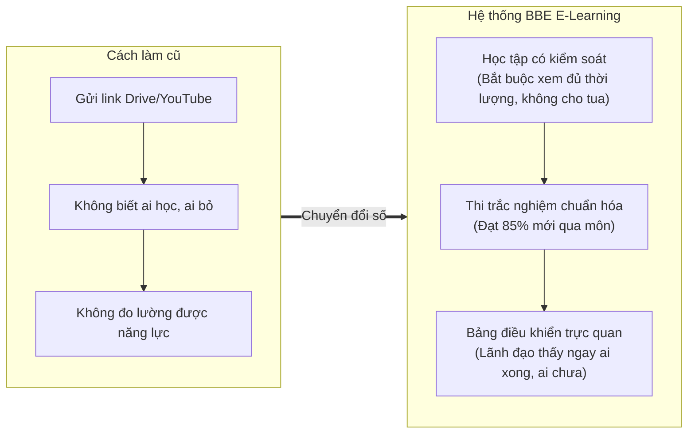
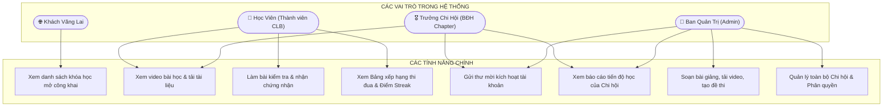
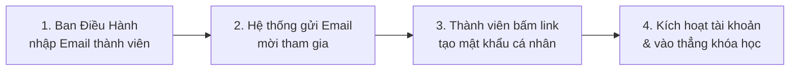
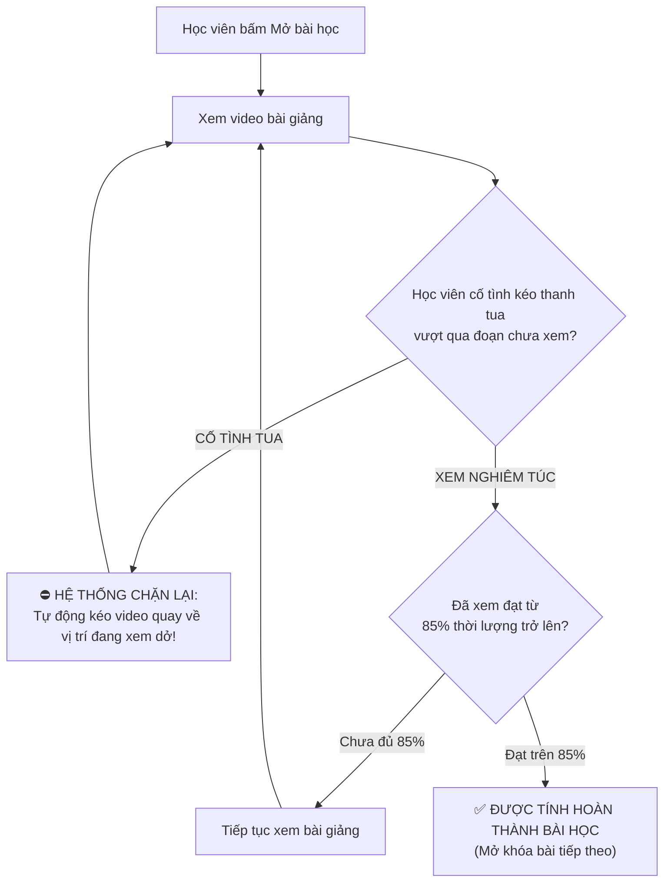
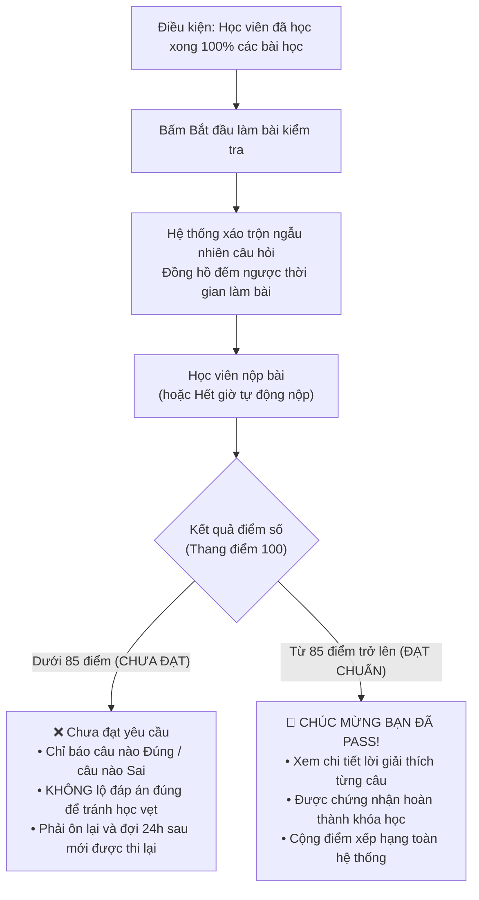
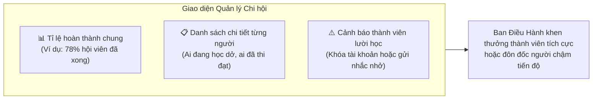

# 🎓 GIỚI THIỆU TỔNG QUAN HỆ THỐNG BBE E-LEARNING
> **Tài liệu thuyết trình nghiệp vụ dành cho Khách hàng, Ban Quản trị & Đối tác**  
> *(Phiên bản tinh gọn, trực quan, không dùng thuật ngữ kỹ thuật phức tạp)*

---

## 🌟 1. Hệ thống này giải quyết vấn đề gì?

Trước đây, khi đào tạo thành viên trong Câu lạc bộ:
- ❌ **Gửi video qua Zalo/Drive:** Không ai biết thành viên đã xem thật hay chưa, hay chỉ bấm mở lên rồi tắt.
- ❌ **Không có công cụ kiểm tra:** Không đánh giá được thành viên có thực sự hiểu bài sau khi xem.
- ❌ **Ban Điều Hành (BĐH) mất thời gian:** Phải nhắn tin thủ công hỏi từng người xem đã học chưa.

👉 **BBE E-Learning ra đời như một "Trợ lý đào tạo tự động":**
Giúp hội viên học có kỷ luật, làm bài test đánh giá năng lực thực tế, và Ban Điều Hành có thể nhìn thấy tiến độ của toàn bộ đội ngũ chỉ bằng một cái nhấp chuột.

---

## 👥 2. Sơ đồ Use Case Tổng quan: Ai làm được gì?

Hệ thống được thiết kế với **4 nhóm người dùng** rõ ràng, mỗi nhóm có một không gian làm việc riêng biệt:

### Bảng tóm tắt quyền lợi từng nhóm:
| Nhóm người dùng | Họ nhận được gì & làm được gì? |
|---|---|
| **🌐 Khách vãng lai** | Xem được trang chủ, tìm hiểu các khóa học giới thiệu cộng đồng. |
| **👤 Học viên (Member)** | Được cấp tài khoản riêng; học video; tải tài liệu chuẩn; làm bài thi đánh giá; theo dõi tiến độ cá nhân và thi đua trên bảng xếp hạng. |
| **🎖️ Trưởng Chi hội (BĐHU)** | Mời thành viên mới vào Chi hội của mình; quản lý danh sách; xem báo cáo ai đã học bao nhiêu %, điểm thi ra sao; nhắc nhở học viên. |
| **👑 Ban Quản trị (Admin)** | Soạn thảo giáo trình đào tạo, đăng tải video, tạo ngân hàng câu hỏi đề thi, quản lý tất cả các Chi hội trên toàn quốc. |

---

## 🔄 3. Cách Hệ Thống Vận Hành (4 Luồng Nghiệp Vụ Chính)

---

### Luồng 1: Quy trình Tham gia & Bắt đầu Học (Onboarding)
> *Đảm bảo chỉ có thành viên chính thức mới được vào học, không cho người ngoài tự do đăng ký.*

* **Điểm an toàn:** Thư mời có hạn trong 24 giờ. Tránh trường hợp gửi nhầm hoặc tài khoản ảo.

---

### Luồng 2: Cơ chế "Học Thật - Không Tua" (Anti-Cheat Video)
> *Giải quyết dứt điểm tình trạng học viên mở video lên rồi kéo thanh tua tới cuối để lấy điểm danh.*

---

### Luồng 3: Quy trình Thi & Đánh giá Năng lực (Assessment)
> *Học xong là phải nắm được bài. Thi thật, điểm thật, tránh học vẹt.*

---

### Luồng 4: Bảng Điều Khiển Giám Sát Dành Cho Ban Lãnh Đạo
> *Giúp Trưởng Chi hội nắm bắt tình hình đào tạo trong 30 giây mà không cần gọi điện hỏi từng người.*

---

## 🏆 4. Bảng So Sánh Giá Trị Cho Khách Hàng

| Tiêu chí | Dùng Google Drive / YouTube / Zalo | Nền tảng BBE E-Learning |
|---|:---:|:---:|
| **Kiểm soát người học** | ❌ Không biết ai đã xem, xem bao nhiêu phút | ✅ Ghi nhận chính xác từng giây học viên đã xem |
| **Chống tua video** | ❌ Học viên tua nhanh 30 giây là xong | ✅ Chặn tua; bắt buộc xem $\ge 85\%$ mới được công nhận |
| **Đánh giá kiến thức** | ❌ Không có bài kiểm tra hoặc phải làm form ngoài rời rạc | ✅ Đề thi trắc nghiệm ngẫu nhiên, tự động chấm điểm ngay |
| **Chống lộ đề & học vẹt** | ❌ Trả lời sai vẫn thấy đáp án để chọn lại | ✅ Dưới 85 điểm không hiện đáp án, phải đợi 24h mới thi lại |
| **Báo cáo cho Lãnh đạo** | ❌ Phải hỏi từng người, tổng hợp excel thủ công | ✅ Báo cáo biểu đồ tự động, xem được ngay trên điện thoại/máy tính |
| **Tạo động lực học tập** | ❌ Cảm giác đơn độc, nhanh chán | ✅ Bảng xếp hạng (Leaderboard) & Điểm danh ngày (Streak) |

---

## 💬 5. Kịch Bản Gợi Ý Khi Trình Bày Với Khách Hàng (3 Phút)

> *"Chào anh/chị, hệ thống BBE E-Learning này được xây dựng để giải quyết 3 bài toán lớn nhất trong đào tạo nội bộ:*
> 
> 1. * **Thứ nhất - Đảm bảo học thật:** Khác với việc gửi video xem tùy thích, hệ thống có công nghệ **chống tua**. Thành viên bắt buộc phải xem thực tế từ 85% thời lượng trở lên mới được ghi nhận hoàn thành.
> 2. * **Thứ hai - Đảm bảo hiểu thật:** Khi học xong, thành viên sẽ làm **bài kiểm tra trắc nghiệm**. Đề thi được xáo ngẫu nhiên, nếu không đạt 85/100 điểm thì sẽ không được nhìn đáp án và phải chờ 24 giờ sau mới được thi lại. Điều này giúp loại bỏ hoàn toàn việc đoán mò hay học đối phó.
> 3. * **Thứ ba - Giúp lãnh đạo quản lý nhàn tênh:** Ban Điều Hành mỗi Chi hội có riêng một **Dashboard thông minh**. Mở lên là biết ngay hôm nay Chi hội mình có bao nhiêu người đã hoàn thành, ai học nhanh nhất, ai chưa học để nhắc nhở kịp thời.
> 
> *Tất cả các khâu từ gửi lời mời, cấp tài khoản, giám sát học đến chấm điểm thi đều vận hành tự động 100%!"*

---
*Tài liệu được thiết kế riêng để sử dụng trong các buổi họp, trao đổi nghiệp vụ và trình diễn demo sản phẩm.*
