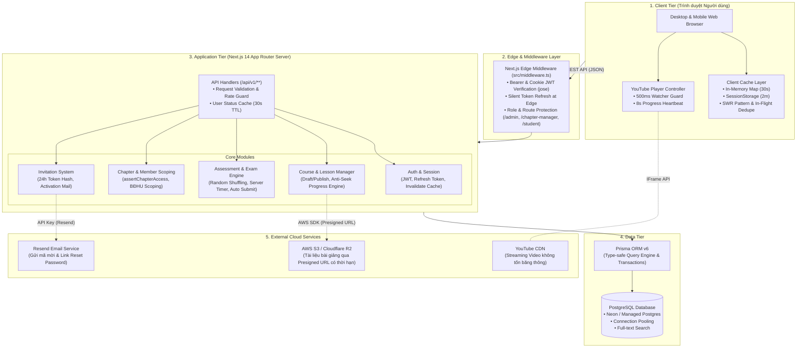
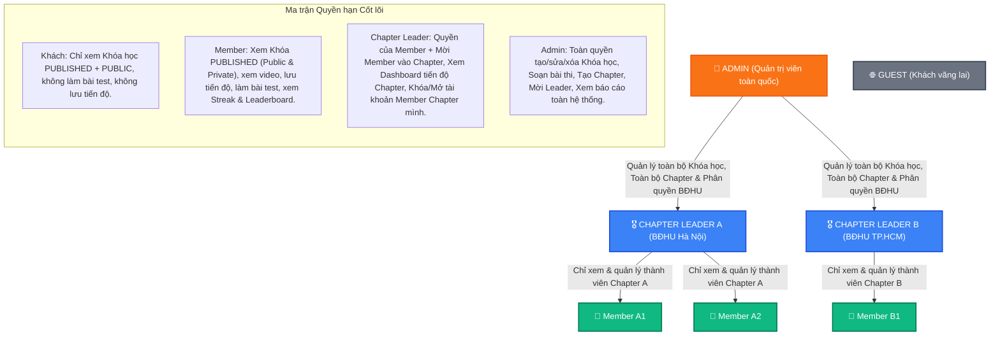
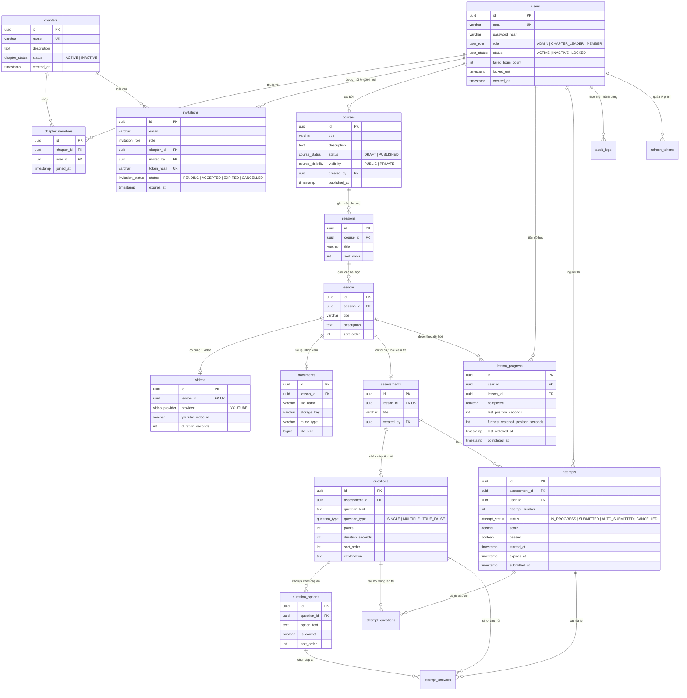
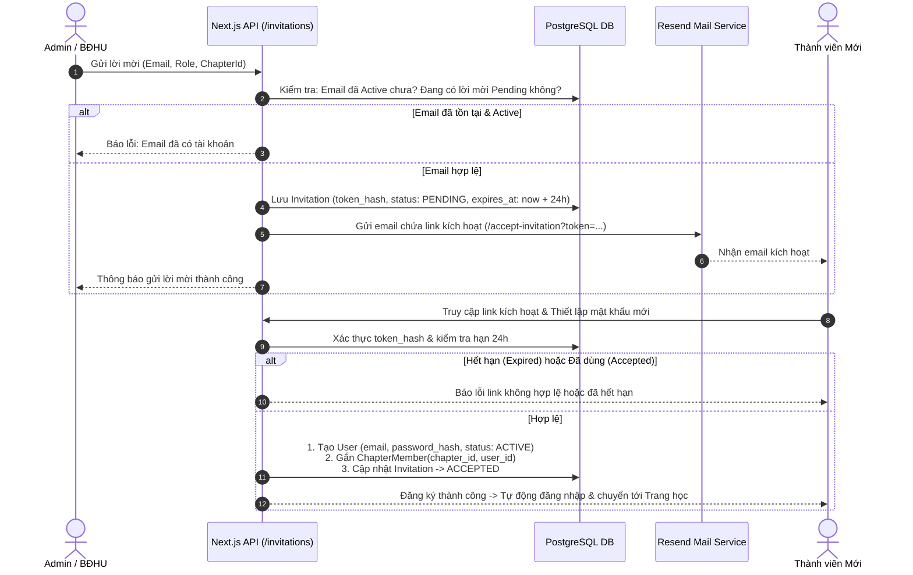
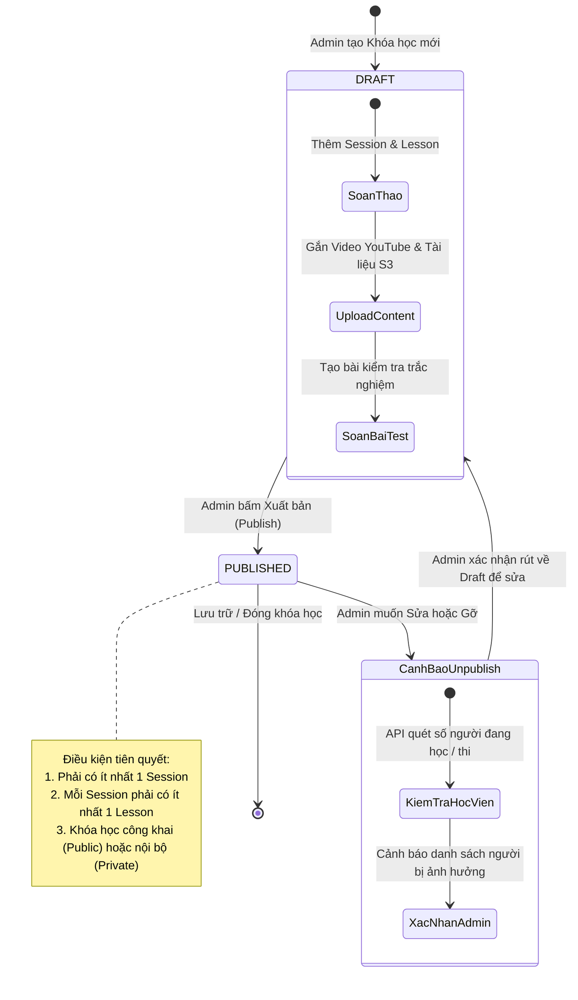
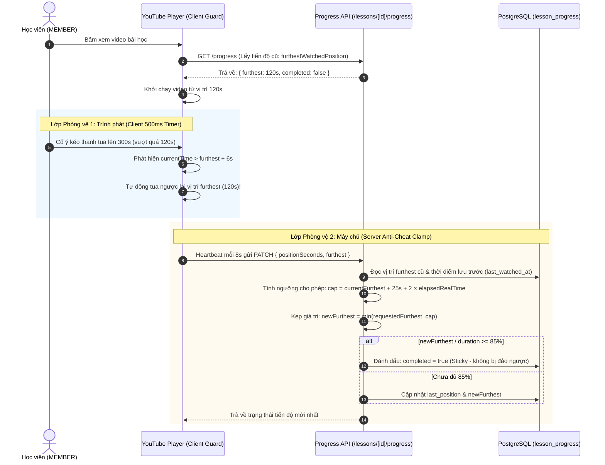
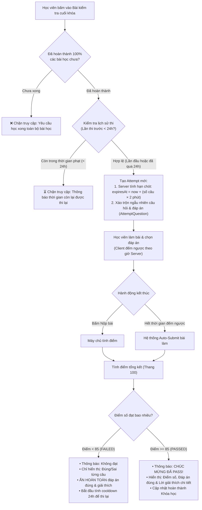
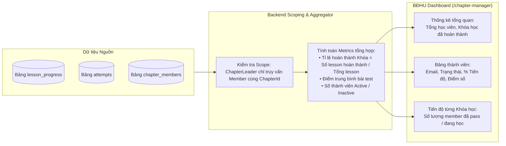
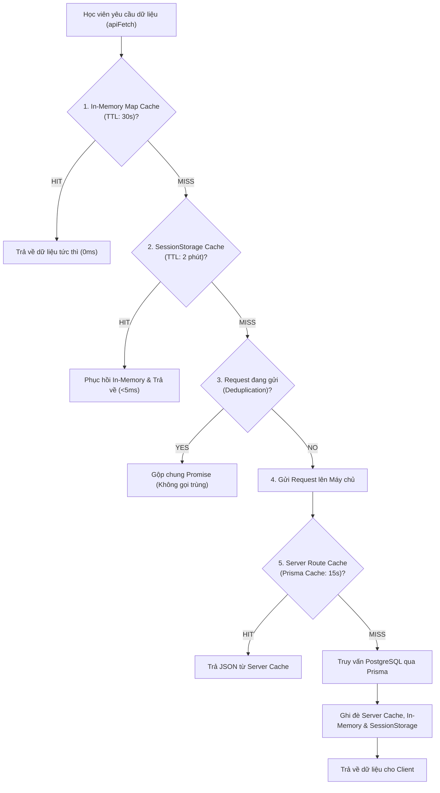

# 📘 TỔNG QUAN KIẾN TRÚC & VẬN HÀNH HỆ THỐNG E-LEARNING BBE
> **Hệ thống Quản lý & Đào tạo Nội bộ Câu lạc bộ Doanh nhân BBE (BBE Learning Hub)**  
> *Tài liệu kỹ thuật và nghiệp vụ tổng quan dành cho Ban Quản trị, Lập trình viên, Stakeholders và Thành viên mới.*

---

## 📑 MỤC LỤC
1. [Giới thiệu & Bài toán Nghiệp vụ](#1-giới-thiệu--bài-toán-nghiệp-vụ)
2. [Sơ đồ Kiến trúc Tổng thể Hệ thống (System Architecture)](#2-sơ-đồ-kiến-trúc-tổng-thể-hệ-thống)
3. [Mô hình Phân quyền & Quản trị Theo Cấp bậc (RBAC & Chapter Scope)](#3-mô-hình-phân-quyền--quản-trị-theo-cấp-bậc)
4. [Sơ đồ Thực thể Dữ liệu (Database ERD Diagram)](#4-sơ-đồ-thực-thể-dữ-liệu-database-erd)
5. [Các Luồng Vận hành Nghiệp vụ Cốt lõi (Core Business Flows)](#5-các-luồng-vận-hành-nghiệp-vụ-cốt-lõi)
   - [5.1 Luồng Mời & Kích hoạt Tài khoản (Invitation Flow)](#51-luồng-mời--kích-hoạt-tài-khoản)
   - [5.2 Luồng Vòng đời Khóa học & Xuất bản (Course Lifecycle)](#52-luồng-vòng-đời-khóa-học--xuất-bản)
   - [5.3 Luồng Học tập & Cơ chế Chống Tua Video (Anti-Seek Progress Flow)](#53-luồng-học-tập--cơ-chế-chống-tua-video)
   - [5.4 Luồng Làm Bài Kiểm tra & Đánh giá Năng lực (Assessment & Retake Flow)](#54-luồng-làm-bài-kiểm-tra--đánh-giá-năng-lực)
   - [5.5 Luồng Giám sát & Báo cáo Tiến độ Chapter (Dashboard & Analytics)](#55-luồng-giám-sát--báo-cáo-tiến-độ-chapter)
6. [Chiến lược Hiệu năng & Bảo mật (Performance & Security)](#6-chiến-lược-hiệu-năng--bảo-mật)
7. [Bản đồ Cấu trúc Thư mục Codebase](#7-bản-đồ-cấu-trúc-thư-mục-codebase)

---

## 1. Giới thiệu & Bài toán Nghiệp vụ

### 1.1 Bối cảnh
Trước khi có hệ thống, hoạt động đào tạo của **Câu lạc bộ Doanh nhân BBE** diễn ra phân tán hoặc offline. Thành viên mới tham gia vào các Chapter (Chi hội) khác nhau bị thiếu hụt kiến thức nền tảng, không có tài liệu chuẩn hóa, và **Ban Điều Hành Chapter (BĐHU)** không thể theo dõi ai đã hoàn thành chương trình đào tạo.

### 1.2 Giải pháp của Hệ thống (BBE E-Learning Hub)
- **Tập trung hóa tri thức:** Lưu trữ toàn bộ video đào tạo (tích hợp YouTube CDN không tốn băng thông) và tài liệu đính kèm (lưu trữ Cloud Object Storage an toàn).
- **Phân cấp quản trị linh hoạt:** Admin quản lý toàn hệ thống, Chapter Leader chỉ quản lý và theo dõi tiến độ của thành viên thuộc Chapter mình.
- **Học thật - Thi thật:**
  - **Chống tua video (Anti-Seek):** Người học không thể tua trước đoạn chưa xem; hệ thống giám sát tiến trình xem video (yêu cầu xem $\ge 85\%$ mới được tính hoàn thành bài học).
  - **Đánh giá chuẩn xác (Assessment):** Đề thi trắc nghiệm ngẫu nhiên, tự động nộp bài khi hết giờ, yêu cầu đạt $\ge 85/100$ điểm, giới hạn làm lại (cooldown 24h) để tránh học vẹt.
- **Thúc đẩy động lực:** Hệ thống Streak hàng ngày và Bảng xếp hạng (Leaderboard) toàn quốc và nội bộ từng Chapter.

---

## 2. Sơ đồ Kiến trúc Tổng thể Hệ thống

Hệ thống được xây dựng theo kiến trúc **Monolithic hiện đại** dựa trên **Next.js 14 App Router** (Full-stack TypeScript), kết hợp Edge Middleware, Prisma ORM và các dịch vụ đám mây chuyên dụng.



---

## 3. Mô hình Phân quyền & Quản trị Theo Cấp bậc

Hệ thống triển khai mô hình **RBAC (Role-Based Access Control)** kết hợp **Chapter Scoping (Phân lập dữ liệu theo Chi hội)** nghiêm ngặt.



> [!IMPORTANT]
> **Nguyên tắc Bảo mật Scoping (FR-DB-01):**
> Backend luôn thực thi hàm `assertChapterAccess(request, targetChapterId)`. Một Chapter Leader thuộc Chapter Hà Nội **tuyệt đối không thể** xem hoặc sửa đổi dữ liệu thành viên Chapter TP.HCM dù cố tình thay đổi `chapterId` trên URL hay API.

---

## 4. Sơ đồ Thực thể Dữ liệu (Database ERD)

Cơ sở dữ liệu PostgreSQL gồm 15 bảng quan hệ được chuẩn hóa cao độ, phục vụ trọn vẹn từ Tài khoản, Khóa học, Tiến độ, Đề thi đến Nhật ký kiểm toán.



---

## 5. Các Luồng Vận hành Nghiệp vụ Cốt lõi

### 5.1 Luồng Mời & Kích hoạt Tài khoản
Quy trình onboard thành viên an toàn, loại bỏ việc đăng ký tự do để đảm bảo 100% người dùng là thành viên BBE thực thụ.



---

### 5.2 Luồng Vòng đời Khóa học & Xuất bản

Khóa học được bảo vệ nghiêm ngặt để tránh ảnh hưởng đến học viên đang theo học.



---

### 5.3 Luồng Học tập & Cơ chế Chống Tua Video (BR-03)
Đây là tính năng kỹ thuật nổi bật nhất của hệ thống, bảo vệ tính trung thực trong đào tạo qua **2 lớp phòng vệ (Client + Server)**.



---

### 5.4 Luồng Làm Bài Kiểm tra & Đánh giá Năng lực (BR-04)



---

### 5.5 Luồng Giám sát & Báo cáo Tiến độ Chapter

Dành riêng cho **Ban Điều Hành (BĐHU)** để quản lý thành viên thực tế tại địa phương.



---

## 6. Chiến lược Hiệu năng & Bảo mật

### 6.1 Cơ chế Caching Đa tầng (Multi-Tier Caching)
Nhằm đáp ứng yêu cầu **NFR-PERF-01** (tải trang danh sách khóa học $\le 3$ giây với 500 người dùng đồng thời):



### 6.2 Bảo vệ Tài nguyên & Media
- **Video:** Nhúng qua **YouTube IFrame API**. Video ở chế độ Unlisted (Không công khai), trình phát ẩn tiêu đề và đường link trực tiếp, loại bỏ việc thành viên tải lậu video hoặc rò rỉ băng thông máy chủ.
- **Tài liệu (Document):** Lưu trữ tại **AWS S3 / Cloudflare R2**. Khi học viên bấm tải hoặc xem, hệ thống tạo **Presigned URL** với thời hạn chỉ 5 - 15 phút. Người không có tài khoản hoặc truy cập URL trực tiếp quá hạn sẽ bị từ chối truy cập (**NFR-SEC-01**).

### 6.3 Quản lý Phiên & Token Tự động (Silent Refresh)
- **Access Token:** Hạn ngắn (15 phút), lưu dạng HTTP-only Cookie / Bearer.
- **Refresh Token:** Lưu an toàn trong Database (`refresh_tokens`), thời hạn 7 ngày.
- **Edge Silent Refresh:** Khi Access Token hết hạn, Next.js Edge Middleware tự động phát hiện Refresh Token hợp lệ và cấp ngay Access Token mới trước khi request tới API, người dùng không hề bị ngắt quãng trải nghiệm.
- **Tức thời vô hiệu hóa (Instant Invalidation):** Khi Admin/BĐHU khóa tài khoản một thành viên (`status: LOCKED`), bộ nhớ đệm `userStatusCache` bị xóa lập tức, chặn ngay request tiếp theo của người đó.

---

## 7. Bản đồ Cấu trúc Thư mục Codebase

```
c:\Users\Acer\Desktop\E-learning\
├── prisma/
│   ├── schema.prisma              # Định nghĩa toàn bộ 15 Data Models & Enums
│   ├── seed.ts                    # Script tạo tài khoản Admin & Dữ liệu mẫu ban đầu
│   └── migrations/                # Lịch sử di chuyển cấu trúc CSDL PostgreSQL
│
├── src/
│   ├── middleware.ts              # Edge Middleware (Bảo vệ Route, Silent Refresh, Role Guard)
│   │
│   ├── app/                       # Next.js 14 App Router
│   │   ├── page.tsx               # Landing Page công khai
│   │   ├── login/                 # Trang Đăng nhập (Email + Password)
│   │   ├── accept-invitation/     # Trang Kích hoạt tài khoản & Tạo mật khẩu từ link mời
│   │   ├── forgot-password/       # Quên mật khẩu & Reset password
│   │   ├── leaderboard/           # Bảng xếp hạng thành viên & Chi hội
│   │   │
│   │   ├── admin/                 # Không gian làm việc của ADMIN
│   │   │   ├── dashboard/         # Thống kê tổng thể toàn hệ thống
│   │   │   ├── courses/           # Quản lý khóa học, bài học, video, tài liệu, đề thi
│   │   │   ├── chapters/          # Quản lý danh sách các Chi hội
│   │   │   ├── users/             # Quản lý toàn bộ tài khoản người dùng
│   │   │   └── invitations/       # Quản lý mã mời đã phát hành
│   │   │
│   │   ├── chapter-manager/       # Không gian làm việc của BĐHU (CHAPTER_LEADER)
│   │   │   ├── dashboard/         # Tổng quan tiến độ đào tạo của Chapter mình
│   │   │   ├── members/           # Danh sách & chi tiết tiến độ từng thành viên
│   │   │   ├── courses/           # Báo cáo tỉ lệ hoàn thành theo khóa học
│   │   │   └── invitations/       # Mời thành viên mới vào Chapter
│   │   │
│   │   ├── student/               # Không gian học tập của HỌC VIÊN (MEMBER)
│   │   │   ├── dashboard/         # Khóa học đang học, bài học gần nhất
│   │   │   ├── courses/           # Danh mục khóa học & chi tiết lộ trình
│   │   │   │   └── [id]/quiz/     # Giao diện làm bài kiểm tra trắc nghiệm
│   │   │   ├── learning/[id]/     # Giao diện học video + tải tài liệu
│   │   │   └── progress/          # Nhật ký tiến độ & điểm số cá nhân
│   │   │
│   │   └── api/v1/                # Toàn bộ REST API Handlers
│   │       ├── auth/              # /login, /refresh, /logout
│   │       ├── courses/           # CRUD khóa học, publish/unpublish
│   │       ├── lessons/           # Tiến độ bài học (/progress), heartbeat chống tua
│   │       ├── assessments/       # Quản trị câu hỏi đề thi
│   │       ├── attempts/          # Tạo lần thi, nộp bài, chấm điểm tự động
│   │       ├── chapters/          # API dữ liệu chapter & dashboard scoping
│   │       ├── invitations/       # Tạo, hủy, gửi lại lời mời
│   │       ├── leaderboard/       # Bảng xếp hạng điểm số & streak
│   │       └── documents/         # Tạo Presigned URL xem tài liệu S3
│   │
│   ├── components/                # React UI Components
│   │   ├── YouTubePlayer.tsx      # Video Player có logic chống tua 500ms + heartbeat 8s
│   │   └── layout/                # Sidebar, Header theo từng Role
│   │
│   └── lib/                       # Các thư viện & Helper dùng chung
│       ├── prisma.ts              # Singleton Prisma Client Instance
│       ├── auth.ts                # Xác thực JWT, User Status Cache & Scope Resolver
│       ├── email.ts               # Tích hợp gửi mail Resend
│       └── api/client.ts          # Bộ Fetch Client hiệu năng cao (In-Memory + Session Cache)
│
└── docs/                          # Toàn bộ tài liệu phân tích nghiệp vụ & kiến trúc
    ├── ba-document.md             # Tài liệu Business Analysis chi tiết
    ├── codebase-context.md        # Ghi chú kiến trúc & các quyết định kỹ thuật
    └── TONG_QUAN_KIEN_TRUC_VA_VAN_HANH_HE_THONG.md # File tài liệu này
```

---

## 8. Hướng dẫn Dành cho Người mới Tiếp cận Dự án

1. **Khởi chạy Hệ thống ở Môi trường Local:**
   ```bash
   # 1. Cài đặt các gói phụ thuộc
   npm install

   # 2. Đồng bộ CSDL và tạo Prisma Client
   npm run db:push
   npm run db:generate

   # 3. Nạp dữ liệu mẫu (Tạo Admin mặc định, Khóa học mẫu & Câu hỏi thi)
   npm run db:seed

   # 4. Khởi chạy máy chủ phát triển
   npm run dev
   ```

2. **Tài khoản Trải nghiệm Mặc định (Seed Data):**
   - **Admin:** `admin@bbe.com` / Mật khẩu: `admin123`
   - **Chapter Leader (BĐHU):** `leader@bbe.com` / Mật khẩu: `leader123`
   - **Thành viên (Member):** `member@bbe.com` / Mật khẩu: `member123`

---
*Tài liệu được biên soạn và bảo trì bởi Đội ngũ Phát triển BBE E-Learning.*
